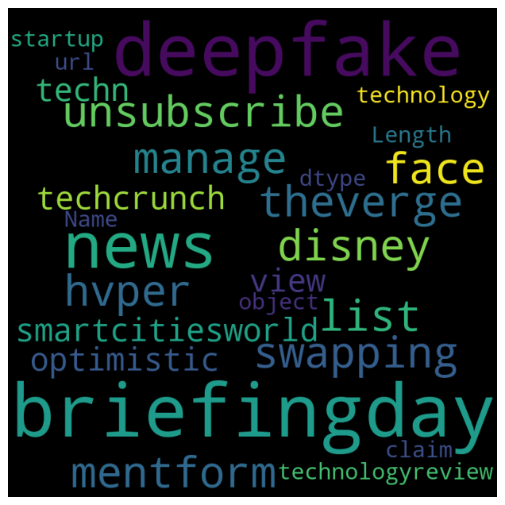

# NLP Spam Detector

This project focuses on building a robust system for detecting spam in URLs using Natural Language Processing (NLP) techniques and machine learning algorithms. The dataset consists of labeled URLs classified as either spam or not spam, enabling the development of an effective spam detection model.

## Key Features

- **Data Preprocessing:** The URLs undergo extensive preprocessing, including cleaning, tokenization, lemmatization, and the removal of stopwords.
- **Feature Extraction:** Utilizes TF-IDF vectorization to convert URL text data into numerical representations suitable for machine learning models.
- **Model Training and Evaluation:** Implements a Support Vector Machine (SVM) classifier to achieve high accuracy in spam detection.
- **Hyperparameter Tuning:** Includes a GridSearchCV process to optimize model parameters for better performance.
- **Visualization:** Generates a word cloud to visualize the most frequent terms in the dataset.

## Workflow

### Data Loading and Cleaning
- Imported dataset from GitHub.
- Removed duplicates and reset the index.

### Preprocessing
- Stripped unnecessary characters (e.g., www, com, https).
- Filtered out short or irrelevant tokens and lemmatized the text.

### Feature Engineering
- Used TfidfVectorizer to transform text data into a numerical feature matrix with up to 5000 features.

### Model Training
- Split the data into training and testing sets using an 80-20 ratio.
- Trained an SVM classifier with a linear kernel.

### Evaluation
- Achieved a baseline accuracy of 95.36%.
- Improved to 96.20% after hyperparameter tuning with GridSearchCV.

### Model Saving
- Saved the final SVM model using Python's pickle module for future use.

## Results

- **Initial accuracy:** 95.36%
- **Final accuracy after tuning:** 96.20%
- **Spam and non-spam distribution:** 696 spam URLs, 2303 non-spam URLs (before preprocessing).

### Visualization
- A word cloud was created to highlight the most common terms in spam and non-spam URLs.

## Tools and Technologies

- **Languages:** Python
- **Libraries:** Pandas, NumPy, Scikit-learn, Matplotlib, WordCloud, NLTK
- **Algorithms:** Support Vector Machine (SVM)

## Future Improvements

- Experiment with deep learning models, such as neural networks, for potentially better accuracy.
- Expand the dataset to include more diverse URLs and improve model robustness.
- Develop a web application to deploy the spam detection model and make it accessible to users.

## Contributing

Contributions are welcome! If you have suggestions for improvements or new features, feel free to open an issue or submit a pull request.

